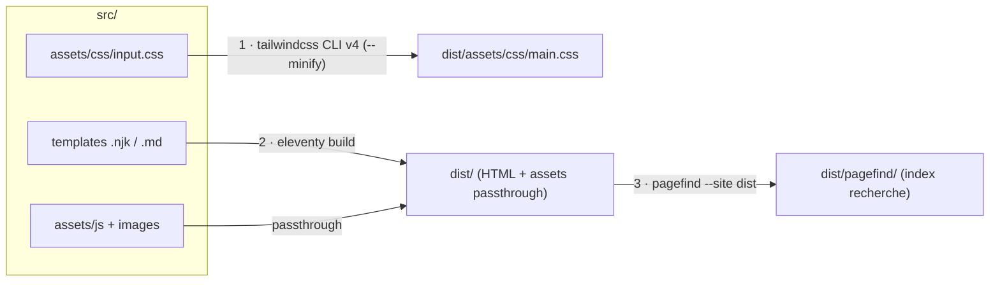
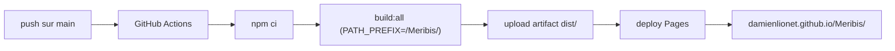

# Architecture cible — Meribis

Référence technique du projet **Meribis** (recréation du site Meritis). La spec produit/fonctionnelle
vit dans [project-spec.md](project-spec.md) ; ce document décrit **comment** on la met en œuvre et
fait foi sur les choix techniques. `Meribis` est le nom de code du projet ; `Meritis` reste la marque.

---

## 1. Stack & principes

| Couche | Choix | Pourquoi |
|---|---|---|
| Génération statique | **Eleventy v3** (ESM) | Léger, sortie HTML pure, pas de runtime |
| Templates | **Nunjucks** (`.njk`) | Layouts + partials réutilisables |
| Styles | **Tailwind CSS v4** (CSS-first `@theme`) | Design system par tokens, CSS purgé |
| Contenu | **Markdown + front matter YAML** | Versionnable, publiable sans toucher aux templates |
| Données | **JSON** dans `_data/` | Config, navigation, i18n, taxonomies |
| Interactions | **JavaScript vanilla** | Pas de framework SPA, amélioration progressive |
| Recherche | **Pagefind** | Index statique généré à la build, zéro maintenance |
| Formulaires | **Service externe** | Pas de backend ; endpoint configurable |
| Hébergement | **GitHub Pages** (page projet) | Statique, déploiement Git |
| CI/CD | **GitHub Actions** | Build + déploiement sur push `main` |

Principes : minimum de code, modifications chirurgicales, site consultable sans JS, cibles Lighthouse
90+ (Perf / A11y / SEO), WCAG 2.2 AA. Détail dans [CLAUDE.md](../CLAUDE.md).

---

## 2. Décisions verrouillées (2026-06-15)

Ces choix **priment sur la spec** quand elle diverge (elle décrivait Tailwind v3 et un `.eleventy.js`
CommonJS — obsolète ici).

- **Eleventy v3 en ESM** — config `eleventy.config.js` avec `export default` (pas de `.eleventy.js`).
- **Tailwind v4 CSS-first** — tokens en `@theme` dans `src/assets/css/input.css`. **Aucun
  `tailwind.config.js`, ni PostCSS, ni Autoprefixer** (gérés nativement par v4).
- **Recherche : Pagefind** — indexe le HTML **déjà généré**, donc après Eleventy.
- **Formulaires : service externe** — URL d'`action` dans `_data/site.json` (`formEndpoint`), fournie
  par le client. Contact + candidature pointent dessus.
- **GitHub Pages, page projet** — `https://damienlionet.github.io/Meribis/`, repo `DamienLionet/Meribis`.
  - `pathPrefix = "/Meribis/"` (override possible via `PATH_PREFIX`).
  - Pas de backend → redirection `/ → /fr/` en HTML statique ; formulaires délégués.

---

## 3. Arborescence cible

`✅` = déjà créé (socle, étape 1) · le reste est à venir (étapes 2 à 4).

```
Meribis/
├─ CLAUDE.md                    ✅ guidance Claude Code
├─ package.json                 ✅ scripts + dépendances
├─ eleventy.config.js           ✅ config Eleventy v3 (ESM, pathPrefix)
├─ .gitignore                   ✅
├─ docs/
│  ├─ project-spec.md           ✅ spec produit (source de vérité fonctionnelle)
│  └─ architecture.md           ✅ ce document
├─ .github/workflows/
│  └─ deploy.yml                ✅ build + déploiement Pages (via Actions)
└─ src/
   ├─ index.njk                 ✅ redirection racine / → /fr/
   ├─ _data/
   │  ├─ site.json              ✅ config globale + formEndpoint
   │  ├─ navigation.json        ⬜
   │  ├─ i18n.json              ⬜ libellés UI FR/EN
   │  └─ taxonomies.json        ⬜
   ├─ _includes/
   │  ├─ layouts/
   │  │  ├─ base.njk            ✅ squelette HTML + CSS/JS
   │  │  ├─ page.njk            ⬜
   │  │  ├─ blog-post.njk       ⬜
   │  │  └─ job-post.njk        ⬜
   │  └─ partials/              ⬜ head, header, footer, nav,
   │                               language-switcher, breadcrumbs, cta-block,
   │                               card-blog, card-job, filters-blog, filters-jobs
   ├─ assets/
   │  ├─ css/input.css          ✅ Tailwind v4 @theme (tokens de marque)
   │  ├─ js/
   │  │  ├─ main.js             ✅ point d'entrée vanilla
   │  │  ├─ filters.js          ⬜ filtres blog/offres
   │  │  └─ search.js           ⬜ intégration Pagefind
   │  └─ images/{brand,blog,jobs}/  ⬜
   └─ content/
      ├─ fr/{pages,blog,jobs}/  ⬜
      └─ en/{pages,blog,jobs}/  ⬜
```

---

## 4. Pipeline de build

Trois étapes, **dans cet ordre** — Pagefind indexe la sortie d'Eleventy, jamais l'inverse :



Commandes (cf. `package.json`) :

| Script | Rôle |
|---|---|
| `npm start` | Dev : `eleventy --serve` + `tailwindcss --watch` en parallèle |
| `npm run build:css` | Compile + minifie le CSS vers `dist/` |
| `npm run build` | Génère le site avec Eleventy (`PATH_PREFIX` appliqué) |
| `npm run build:search` | Génère l'index Pagefind dans `dist/pagefind/` |
| `npm run build:all` | Enchaîne les trois (= ce que lance la CI) |

> **Windows / PowerShell** : les scripts préfixant une variable d'env utilisent `cross-env` pour
> rester identiques en local **et** dans la CI Linux.

> **Dev** : Tailwind écrit `main.css` directement dans `dist/` ; le serveur Eleventy détecte le
> changement de la sortie et recharge le navigateur. Pas de passthrough pour le CSS.

---

## 5. Modèle de contenu & collections

Chaque article de blog / offre d'emploi est **un fichier Markdown + front matter YAML** (formats
détaillés dans [project-spec.md §8](project-spec.md)). Champs structurants :

- `locale` — `fr` ou `en`.
- `translationKey` — **clé stable et identique** entre la version FR et EN d'un même contenu.
- `published` — un contenu avec `published: false` est exclu des collections.
- `date` — ISO `YYYY-MM-DD`, tri décroissant.

Collections définies dans `eleventy.config.js` (filtrées par langue/type, `published !== false`,
triées par date desc) :

```
blog_fr   blog_en   jobs_fr   jobs_en
featured_blog_fr   featured_blog_en   published_jobs_fr   published_jobs_en
```

Les filtres (catégorie, ville, contrat, métier…) et la recherche s'appliquent **côté client** sur
ces listes ; en l'absence de JS, les listes complètes restent affichées (amélioration progressive).

---

## 6. Multilingue & routing

- **Une arborescence par langue** : `src/content/{fr,en}/`. URLs FR et EN distinctes et accessibles
  en direct.
- **Liaison des traductions par `translationKey`** (et non par slug) — c'est elle qui alimente le
  sélecteur de langue et les balises `hreflang`.
- **Libellés d'interface** dans `_data/i18n.json` (`{ fr: {...}, en: {...} }`).
- **Slugs** : minuscules, tirets, sans accent.

Routes attendues (extrait — liste complète dans [project-spec.md §7](project-spec.md)) :

```
/  ->  /fr/            (redirection HTML statique, voir §7)
/fr/  /fr/blog/  /fr/blog/[slug]/  /fr/offres/  /fr/offres/[slug]/  ...
/en/  /en/blog/  /en/blog/[slug]/  /en/jobs/    /en/jobs/[slug]/    ...
```

---

## 7. pathPrefix & le filtre `url` (piège n°1)

Le site est servi sous **`/Meribis/`**. Conséquence non négociable :

> **Tout lien interne et tout asset DOIT passer par le filtre `url` d'Eleventy.**
> Jamais d'URL absolue en dur (`/assets/...`, `/fr/...`) : sans le filtre, le préfixe
> `/Meribis/` n'est pas appliqué et les liens cassent une fois déployés.

```njk
<link rel="stylesheet" href="{{ '/assets/css/main.css' | url }}" />
<a href="{{ '/fr/blog/' | url }}">Blog</a>
```

La base de recherche Pagefind doit également être alignée sur ce préfixe. En local, on peut servir à
la racine avec `PATH_PREFIX=/ npm run build`.

---

## 8. Recherche (Pagefind)

- Indexation **après** le build Eleventy (`build:search` / dernier maillon de `build:all`).
- Pagefind scanne le HTML de `dist/` et écrit son index dans `dist/pagefind/`.
- Intégration front dans `src/assets/js/search.js` (UI Pagefind ou wrapper vanilla), branchée sur les
  pages liste blog et offres.

---

## 9. Formulaires

- Pas de backend (GitHub Pages). Les formulaires (contact + candidature) postent vers un **service
  externe** dont l'URL vit dans `_data/site.json` → `formEndpoint`.
- Champ `applyUrl` des offres : pointe vers le service / l'ATS selon ce qui sera fourni.
- **À fournir par le client** : l'URL d'endpoint définitive.

---

## 10. Déploiement (GitHub Pages + Actions)



- Workflow : `.github/workflows/deploy.yml` (étape 4).
- Émettre un fichier **`.nojekyll`** dans `dist/` pour désactiver le traitement Jekyll.
- Redirection `/ → /fr/` : `index.html` racine (`meta refresh` + JS + `<link rel="canonical">`),
  faute de redirection serveur.

---

## 11. État d'avancement

> **Correction du 2026-06-15** : ce tableau marquait auparavant le socle comme « fichiers créés »
> alors que le dépôt était réellement vierge (hors docs) sur le disque. Le socle a depuis été
> **créé, installé et vérifié** — `npm run build:all` produit un `dist/` conforme (CSS de marque,
> liens préfixés `/Meribis/`, index Pagefind, `.nojekyll`).

| Étape | Contenu | Statut |
|---|---|---|
| **1. Socle build** | deps installées, `eleventy.config.js`, `input.css` (@theme + tokens), `base.njk`, `site.json`, `main.js`, page démo `/fr/`, redirect racine, `.gitignore` | **✅ Fait** — `build:all` vérifié |
| **Déploiement (anticipé)** | workflow GitHub Actions, indexation Pagefind dans `build:all`, `.nojekyll` | **✅ En ligne** — déployé sur https://damienlionet.github.io/Meribis/ (dépôt rendu public car Pages indisponible en privé/gratuit ; Pages = source Actions) |
| **2. Chrome + bilingue** | layouts `base` (header/`<main>`/footer/hreflang) + `page`, partials header/footer/language-switcher/breadcrumbs/cta-block, `i18n.json` / `navigation.json`, pages Accueil + À propos FR/EN reliées par `translationKey` | **✅ Fait** — `build:all` vérifié (5 pages, 2 langues) |
| 3. Collections + types | layouts `blog-post` / `job-post`, partials `card-blog` / `card-job`, collections `blog_*` / `jobs_*` (+ `featured_*` / `published_*`), `taxonomies.json`, contenus d'exemple FR/EN | À faire |
| 4. Recherche + filtres (front) | UI Pagefind (`search.js`), filtres combinés vanilla (`filters.js`), partials `filters-*` | À faire |

> **Prochaine action concrète** : étape 3 — types `blog-post` / `job-post`, collections
> `blog_*` / `jobs_*`, `taxonomies.json` et contenus d'exemple FR/EN.
