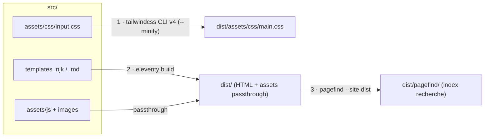
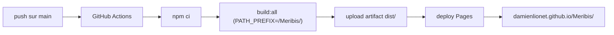

# Architecture cible — Meribis

Référence technique du projet **Meribis** (recréation du site Meritis). La spec produit/fonctionnelle
vit dans [project-spec.md](project-spec.md) ; ce document décrit **comment** on la met en œuvre et
fait foi sur les choix techniques. `Meribis` est le nom de code du projet ; `Meritis` reste la marque.

---

## 1. Stack & principes

| Couche | Choix | Pourquoi |
|---|---|---|
| Génération statique | **Eleventy v3** (ESM) | Léger, sortie HTML pure, pas de runtime |
| Templates | **Nunjucks** (`.njk`) | Layouts + partials réutilisables |
| Styles | **Tailwind CSS v4** (CSS-first `@theme`) | Design system par tokens, CSS purgé |
| Contenu | **Markdown + front matter YAML** | Versionnable, publiable sans toucher aux templates |
| Données | **JSON** dans `_data/` | Config, navigation, i18n, taxonomies |
| Interactions | **JavaScript vanilla** | Pas de framework SPA, amélioration progressive |
| Recherche | **Pagefind** | Index statique généré à la build, zéro maintenance |
| Formulaires | **Microsoft Forms (iframe)** | Pas de backend ; préremplissage `?source=` |
| Hébergement | **GitHub Pages** (page projet) | Statique, déploiement Git |
| CI/CD | **GitHub Actions** | Build + déploiement sur push `main` |

Principes : minimum de code, modifications chirurgicales, site consultable sans JS, cibles Lighthouse
90+ (Perf / A11y / SEO), WCAG 2.2 AA. Détail dans [CLAUDE.md](../CLAUDE.md).

---

## 2. Décisions verrouillées (2026-06-15)

Ces choix **priment sur la spec** quand elle diverge (elle décrivait Tailwind v3 et un `.eleventy.js`
CommonJS — obsolète ici).

- **Eleventy v3 en ESM** — config `eleventy.config.js` avec `export default` (pas de `.eleventy.js`).
- **Tailwind v4 CSS-first** — tokens en `@theme` dans `src/assets/css/input.css`. **Aucun
  `tailwind.config.js`, ni PostCSS, ni Autoprefixer** (gérés nativement par v4).
- **Recherche : Pagefind** — indexe le HTML **déjà généré**, donc après Eleventy.
- **Formulaires : Microsoft Forms en iframe** — la page Contact intègre un formulaire MS Forms ; le
  champ « source » se préremplit depuis `?source=`. Le `formEndpoint` de `_data/site.json` est un
  vestige inutilisé (voir §9).
- **GitHub Pages, page projet** — `https://damienlionet.github.io/Meribis/`, repo `DamienLionet/Meribis`.
  - `pathPrefix = "/Meribis/"` (override possible via `PATH_PREFIX`).
  - Pas de backend → redirection `/ → /fr/` en HTML statique.

---

## 3. Arborescence du dépôt

Tout le socle ci-dessous est **en place**. Le contenu est **bilingue par dossier** : chaque élément
vit dans un dossier contenant un fichier `fr` et un fichier `en` (la `locale` vient du nom de fichier,
le `translationKey` du nom de dossier — cf. `src/content/content.11tydata.js`).

```
Meribis/
├─ CLAUDE.md                  guidance Claude Code
├─ package.json               scripts + dépendances
├─ eleventy.config.js         config Eleventy v3 (ESM, pathPrefix, collections, filtres)
├─ .gitignore
├─ docs/
│  ├─ project-spec.md         spec produit (source de vérité fonctionnelle)
│  ├─ architecture.md         ce document
│  └─ comprendre-le-site.md   vue d'ensemble non technique
├─ .github/workflows/
│  └─ deploy.yml              build + déploiement Pages (GitHub Actions)
└─ src/
   ├─ index.njk               redirection racine / → /fr/
   ├─ 404.njk · sitemap.njk · robots.njk · .nojekyll
   ├─ _data/                  site · navigation · i18n · taxonomies · footerLinks (+ build.js)
   ├─ _includes/
   │  ├─ layouts/             base · page · blog-post · news-post · job-post
   │  └─ partials/            header · footer · language-switcher · breadcrumbs · page-hero
   │                          · cta-block · decor-bubbles · card-blog · card-job
   │                          · filters-blog · filters-jobs
   ├─ assets/
   │  ├─ css/input.css        Tailwind v4 @theme (tokens de marque) + styles
   │  ├─ js/main.js           menu mobile, menus déroulants, bascule .no-js → .js
   │  ├─ js/filters.js        filtres combinés blog/offres (vanilla)
   │  ├─ fonts/               Aptos (woff2 auto-hébergés)
   │  ├─ favicons/
   │  └─ images/              brand · blog · news · expertise · expertises
   └─ content/                un dossier par contenu, avec `fr` + `en` côte à côte
      ├─ pages/{home,expertise,about,adn,rse,contact,search,blog-index,news-index,…}/{fr,en}.{njk,md}
      ├─ blog/{slug}/{fr,en}.md
      ├─ news/{slug}/{fr,en}.md
      ├─ jobs/{slug}/{fr,en}.md
      └─ expertises/{slug}/{fr,en}.md
```

> La recherche (Pagefind UI) est intégrée **inline** dans `content/pages/search/{fr,en}.njk` — il n'y
> a pas de `assets/js/search.js`.

---

## 4. Pipeline de build

Trois étapes, **dans cet ordre** — Pagefind indexe la sortie d'Eleventy, jamais l'inverse :



Commandes (cf. `package.json`) :

| Script | Rôle |
|---|---|
| `npm start` | Dev : `eleventy --serve` + `tailwindcss --watch` en parallèle |
| `npm run build:css` | Compile + minifie le CSS vers `dist/` |
| `npm run build` | Génère le site avec Eleventy (`PATH_PREFIX` appliqué) |
| `npm run build:search` | Génère l'index Pagefind dans `dist/pagefind/` |
| `npm run clean` | Vide `dist/` (évite les pages périmées après renommage/suppression) |
| `npm run build:all` | `clean` puis enchaîne les trois (= ce que lance la CI) |

> **Windows / PowerShell** : les scripts préfixant une variable d'env utilisent `cross-env` pour
> rester identiques en local **et** dans la CI Linux.

> **Dev** : Tailwind écrit `main.css` directement dans `dist/` ; le serveur Eleventy détecte le
> changement de la sortie et recharge le navigateur. Pas de passthrough pour le CSS.

---

## 5. Modèle de contenu & collections

Chaque article de blog / actualité / offre d'emploi est **un fichier Markdown + front matter YAML**
(formats détaillés dans [project-spec.md §8](project-spec.md)). Champs structurants :

- `locale` et `translationKey` — **calculés automatiquement** depuis le chemin (`locale` ← nom de
  fichier `fr`/`en`, `translationKey` ← nom de dossier), via `src/content/content.11tydata.js`. Le
  `translationKey` relie les versions FR et EN ; rien à saisir à la main.
- `published` — un contenu avec `published: false` est exclu des collections.
- `date` — ISO `YYYY-MM-DD`, tri décroissant.

Collections définies dans `eleventy.config.js` (filtrées par langue/type, `published !== false`,
triées par date desc) :

```
blog_fr   blog_en   news_fr   news_en   jobs_fr   jobs_en
featured_blog_fr   featured_blog_en
```

Les filtres (catégorie, ville, contrat, métier…) et la recherche s'appliquent **côté client** sur
ces listes ; en l'absence de JS, les listes complètes restent affichées (amélioration progressive).

---

## 6. Multilingue & routing

- **Bilingue par dossier** : un dossier par contenu, avec `fr` + `en` côte à côte (et non une
  arborescence `src/content/{fr,en}/`). URLs FR et EN distinctes et accessibles en direct.
- **Liaison des traductions par `translationKey`** (et non par slug) — c'est elle qui alimente le
  sélecteur de langue et les balises `hreflang`.
- **Libellés d'interface** dans `_data/i18n.json` (`{ fr: {...}, en: {...} }`).
- **Slugs** : minuscules, tirets, sans accent.

Routes attendues (extrait — liste complète dans [project-spec.md §7](project-spec.md)) :

```
/  ->  /fr/            (redirection HTML statique, voir §7)
/fr/  /fr/blog/  /fr/blog/[slug]/  /fr/offres/  /fr/offres/[slug]/  ...
/en/  /en/blog/  /en/blog/[slug]/  /en/jobs/    /en/jobs/[slug]/    ...
```

---

## 7. pathPrefix & le filtre `url` (piège n°1)

Le site est servi sous **`/Meribis/`**. Conséquence non négociable :

> **Tout lien interne et tout asset DOIT passer par le filtre `url` d'Eleventy.**
> Jamais d'URL absolue en dur (`/assets/...`, `/fr/...`) : sans le filtre, le préfixe
> `/Meribis/` n'est pas appliqué et les liens cassent une fois déployés.

```njk
<link rel="stylesheet" href="{{ '/assets/css/main.css' | url }}" />
<a href="{{ '/fr/blog/' | url }}">Blog</a>
```

La base de recherche Pagefind doit également être alignée sur ce préfixe. En local, on peut servir à
la racine avec `PATH_PREFIX=/ npm run build`.

---

## 8. Recherche (Pagefind)

- Indexation **après** le build Eleventy (`build:search` / dernier maillon de `build:all`).
- Pagefind scanne le HTML de `dist/` et écrit son index dans `dist/pagefind/`.
- Intégration front **inline** dans la page de recherche (`content/pages/search/{fr,en}.njk`) :
  Pagefind UI montée sur `#search`, avec un état vide (recherches fréquentes + accès rapides) masqué
  dès qu'une requête est saisie. Pas de `assets/js/search.js` séparé.

---

## 9. Formulaires

- Pas de backend (GitHub Pages). Le **formulaire de contact est un iframe Microsoft Forms** intégré
  dans `content/pages/contact/{fr,en}.njk` ; un petit script préremplit le champ « source » depuis
  `?source=` (ex. le titre de l'offre d'où vient le clic). Sans JS, le formulaire reste utilisable.
- Le champ `formEndpoint` de `_data/site.json` est un **vestige inutilisé** (à retirer ou réaffecter).

---

## 10. Déploiement (GitHub Pages + Actions)



- Workflow : `.github/workflows/deploy.yml`.
- Émettre un fichier **`.nojekyll`** dans `dist/` pour désactiver le traitement Jekyll.
- Redirection `/ → /fr/` : `index.html` racine (`meta refresh` + JS + `<link rel="canonical">`),
  faute de redirection serveur.

---

## 11. État d'avancement

> **Mise à jour** : socle, chrome bilingue, collections, contenus, recherche et filtres sont en
> place ; le site est **entièrement bilingue FR/EN** et la home a été enrichie. Le dernier `build:all`
> validé datait d'avant les ajouts EN / home / recherche — penser à le relancer pour revalider.

| Étape | Contenu | Statut |
|---|---|---|
| **1. Socle build** | deps, `eleventy.config.js`, `input.css` (@theme + tokens), `base.njk`, `site.json`, `main.js`, redirect racine, `.gitignore` | **✅ Fait** |
| **Déploiement** | workflow GitHub Actions, Pagefind dans `build:all`, `.nojekyll` | **✅ En ligne** — https://damienlionet.github.io/Meribis/ (dépôt public car Pages indisponible en privé/gratuit ; source = Actions) |
| **2. Chrome + bilingue** | layouts `base` + `page`, partials header/footer/language-switcher/breadcrumbs/cta-block/page-hero/decor-bubbles, `i18n.json` / `navigation.json` / `footerLinks.json` | **✅ Fait** |
| **3. Collections + contenus** | layouts `blog-post` / `news-post` / `job-post` (+ JSON-LD), `card-blog` / `card-job` (lien étiré), pages liste FR/EN, collections `blog_*` / `news_*` / `jobs_*` / `featured_blog_*`, `taxonomies.json` ; 10 articles + 10 actualités + 16 offres | **✅ Fait** |
| **4. Recherche + filtres** | Pagefind UI **inline** dans la page recherche (+ état vide : recherches fréquentes + accès rapides), filtres combinés vanilla (`filters.js`) + partials `filters-blog` / `filters-jobs` | **✅ Fait** |
| **5. Bilingue complet + home** | versions **EN** des 9 expertises, des 10 actualités et de la liste actualités ; nav EN alignée sur le FR (menu déroulant + News) ; home refondue (indicateurs, expertises condensées, 3 entités, secteurs clients, bloc RSE/B Corp, teasers blog + offres) | **✅ Fait** — non rebuildé dans cette passe |

> **Prochaine action concrète** : relancer `npm run build:all` pour revalider la sortie (les derniers
> ajouts EN / home / recherche n'ont pas été rebuildés), puis nettoyer les reliquats WordPress des
> contenus importés, intégrer les **logos clients** (bande « secteurs » en attendant) et faire la
> relecture éditoriale FR/EN.
