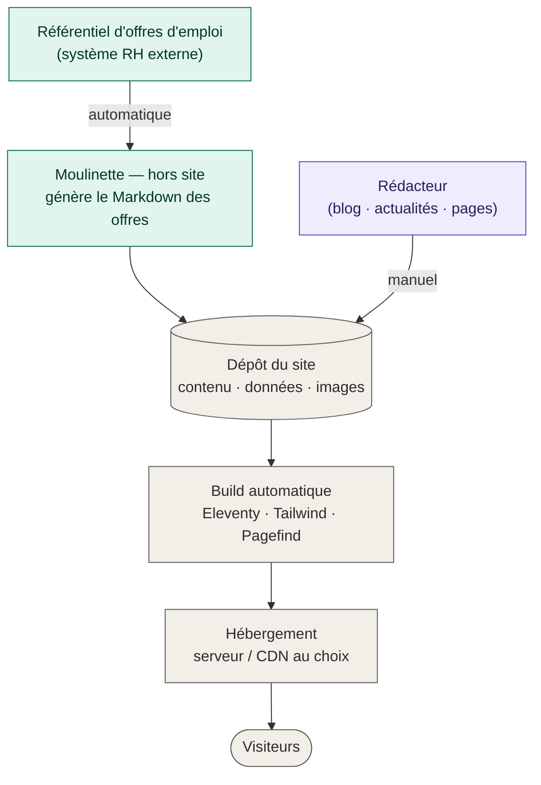
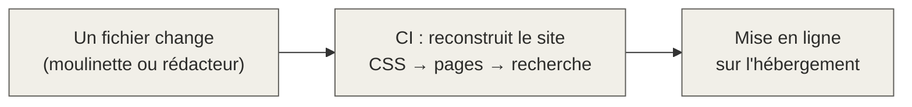
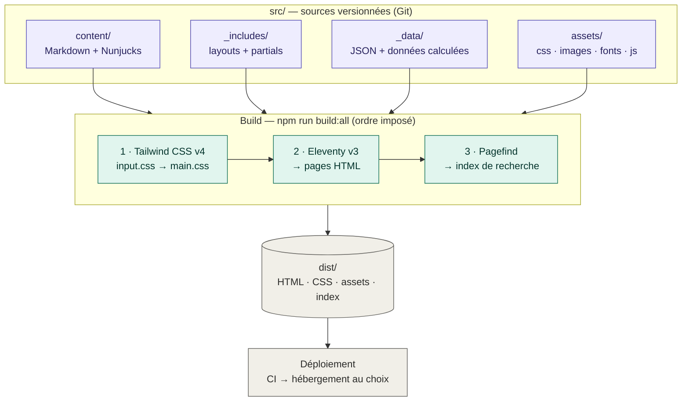

# Comprendre le site Meribis

> Vue d'ensemble **non technique** : comment le site est construit, comment il se publie,
> les grands principes, et les avantages / limites du choix « site statique ».
>
> Pour la version technique détaillée, voir [architecture.md](architecture.md).
> *(Les schémas ci-dessous sont en Mermaid : ils s'affichent comme de vrais diagrammes sur
> GitHub et dans VS Code.)*

---

## 1. En une phrase

C'est un **site statique** : ni base de données, ni serveur applicatif. On décrit le contenu
dans des **fichiers texte**, une « moulinette » de fabrication les transforme **une fois pour
toutes** en pages HTML finies, et ces pages sont simplement servies au visiteur.

**Mettre à jour le site = faire arriver un fichier texte dans le dépôt** — à la main, ou
automatiquement.

---

## 2. L'architecture globale



**Deux sources de contenu** alimentent **un même dépôt**, puis tout est automatique :

- **Voie automatique** — le **référentiel d'offres** alimente une **moulinette installée hors du
  site**. Elle convertit les offres au bon format et les dépose dans le dépôt. Zéro intervention.
- **Voie manuelle** — le **rédacteur** ajoute articles, actualités et modifie les pages.
- **Chaîne commune** — quelle que soit la provenance du fichier, le site est **reconstruit et mis
  en ligne automatiquement**.

> 💡 Point clé : le site ne se soucie pas de *comment* un fichier est arrivé (tapé par un humain ou
> généré par la moulinette). Dans les deux cas il apparaît tout seul dans les listes, les filtres et
> la recherche. C'est ce qui rend l'automatisation des offres facile à brancher.

---

## 3. La structure des fichiers

```
src/
├── content/      → LE CONTENU (ce qu'on édite au quotidien)
│   ├── blog/         articles          (Markdown)
│   ├── news/         actualités        (Markdown)
│   ├── jobs/         offres d'emploi   (Markdown)
│   ├── expertises/   fiches expertise  (Markdown)
│   └── pages/        pages fixes       (Markdown ou Nunjucks)
│
├── _includes/    → LES GABARITS (squelettes HTML réutilisés : en-tête, pied, cartes…)
├── _data/        → LES RÉGLAGES (menu, pied de page, libellés FR / EN)
└── assets/       → MÉDIAS & STYLE (images, polices, JS, input.css)
```

**Le principe d'or : le contenu est séparé de la mécanique.**

| On édite…                       | Où                        | Qui                       |
|---------------------------------|---------------------------|---------------------------|
| Articles, actus, offres, pages  | `src/content/`            | Rédacteur (peu technique) |
| Menu, pied de page, libellés    | `src/_data/`              | Rédacteur avisé           |
| Gabarits, mise en page sur-mesure | `src/_includes/` + `.njk` | Développeur               |

La personne qui rédige n'a **jamais besoin d'ouvrir** `_includes/`.

---

## 4. Comment se passe la publication

Il n'y a **pas de bouton « Publier »**. Tout changement déposé dans le dépôt déclenche
automatiquement une reconstruction et une mise en ligne — **quasi immédiate**.



Deux façons d'alimenter le dépôt :

- **Offre d'emploi → automatique** : créée/modifiée dans le référentiel → la moulinette la publie.
- **Article / actu / page → manuel** : on édite le fichier `.md` (même depuis l'interface web du
  dépôt, sans rien installer) → on valide → publication.

> **L'hébergement est libre.** Le build produit un simple dossier de fichiers statiques (`dist/`)
> déployable sur **n'importe quel hébergeur** (serveur classique, CDN, OVH, Netlify, Vercel,
> bucket de stockage…). *(GitHub Pages n'est utilisé que pour la démo.)*

---

## 5. La chaîne technique de fabrication (le « build »)



**À retenir :**

- **L'ordre n'est pas négociable** : Pagefind indexe le HTML **déjà généré**, donc il passe
  **après** Eleventy. *(Tailwind et Eleventy sont indépendants ; seul Pagefind dépend du résultat
  d'Eleventy.)*
- **Eleventy v3 (ESM)** est le cœur : il assemble le contenu, applique les gabarits, gère le
  bilingue FR/EN (lien automatique entre `fr.md` et `en.md` d'un même dossier) et copie les médias.
- **Tailwind v4** est configuré *dans le CSS* (`input.css`) — pas de fichier de config séparé.
- **`pathPrefix`** (pilotable par variable d'environnement) s'ajuste selon l'hébergeur : `/` à la
  racine d'un domaine, ou un sous-chemin. C'est le **seul** réglage à changer côté hébergement.
- **La sortie `dist/` est 100 % autonome** : un dossier de fichiers, déployable tel quel.

---

## 6. Les grands principes

1. **Contenu séparé de la présentation** — on publie sans toucher aux gabarits.
2. **Contenu = Markdown + « étiquettes »** (front matter) — jamais de texte en dur dans le code.
3. **Bilingue par dossier** — `fr.md` et `en.md` côte à côte sont reliés automatiquement
   (sélecteur de langue + `hreflang` gérés tout seuls).
4. **Listes automatiques** — blog, offres, filtres et recherche se remplissent seuls à partir des
   fichiers présents ; rien à câbler à la main.
5. **Amélioration progressive** — JavaScript minimal et « vanilla » ; le site reste consultable
   **sans JS**.
6. **Tout est versionné dans Git** — historique complet, on sait qui a changé quoi, retour arrière
   en un clic.
7. **Qualité visée** — Lighthouse 90+ (perf, accessibilité, SEO), WCAG 2.2 AA, CSS purgé en prod.

---

## 7. Avantages

- ⚡ **Rapidité** — pages pré-calculées → chargement quasi instantané, excellents scores.
- 🔒 **Sécurité** — pas de base de données ni d'admin en ligne à pirater → surface d'attaque minimale.
- 💸 **Coût** — pas de serveur applicatif à maintenir ; hébergement simple et peu coûteux.
- 📈 **Fiabilité / pics de trafic** — ce ne sont que des fichiers, ça encaisse n'importe quelle affluence.
- 🤖 **Automatisable** — le contenu n'étant « que » des fichiers, on peut brancher une moulinette
  (cas des offres) qui publie sans intervention.
- 🧳 **Indépendance** — on change d'hébergeur très facilement.

---

## 8. Limites

- 🛠️ **Il faut être *un tout petit peu* technique pour gérer le site.** Pas d'interface
  d'administration façon WordPress : on édite du texte (Markdown + étiquettes) et on valide via le
  dépôt. Accessible et vite appris, mais une faute de syntaxe dans l'en-tête d'un fichier peut
  bloquer la génération. *(La moulinette retire ce souci pour les offres.)*
- 🔌 **Pas de fonctions « serveur » natives** — les formulaires (contact, candidature) passent par
  un **service externe** (déjà prévu, adresse centralisée dans la configuration ; reste à fournir).
- 🔎 **Recherche côté navigateur** (Pagefind) — très efficace, mais sur un texte pré-indexé, pas un
  moteur dynamique.
- 🌍 **Traduction manuelle** — la version EN se crée à la main, fichier par fichier. Le site est
  aujourd'hui **entièrement bilingue** (pages, blog, actualités, offres, fiches expertise) ; toute
  nouvelle page doit recevoir sa version EN dans le même dossier.
- 👤 **Pas de personnalisation par visiteur** (espace connecté, contenu sur mesure) — hors de portée
  d'un site purement statique sans briques externes.

---

### En résumé

Pour un site **vitrine premium, bilingue, avec blog / actus / offres alimentées automatiquement**,
le statique offre **performance, sécurité, coût maîtrisé, publication quasi instantanée et
automatisation facile** — en échange d'un socle de gestion *légèrement* technique et de quelques
fonctions dynamiques déléguées à des services externes.
